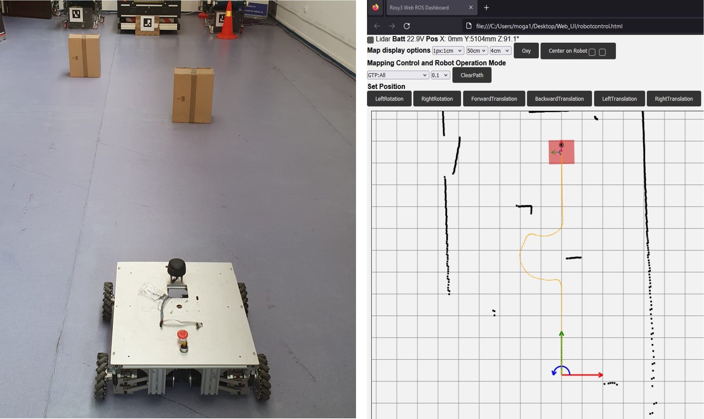
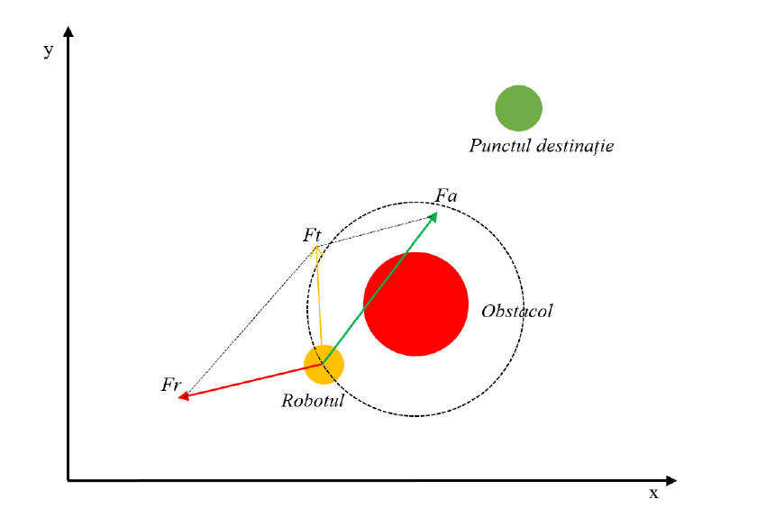

# Obstacle Avoidance Robot with 2D Mapping 🤖🚗

This project implements an obstacle avoidance system using ROS2 🤖, Python 🐍, and JavaScript, designed for a omnidirectional robot controlled via a web interface. 
The system features real-time 2D mapping 📍 powered by LiDAR data, allowing users to visualize the environment directly from the interface.

## 💡 Highlights:
- Platform: Developed on an NVIDIA Jetson board ⚡ for efficient processing.
- Obstacle Avoidance 🚧: Achieved using a potential field method 🌌, combining repulsive forces (from obstacles) and attractive forces (toward the target).
  
- Web Interface: Enables intuitive robot control 🖱️ and live mapping visualization.
- LiDAR Integration: Used for accurate environmental sensing and obstacle detection.
- Frameworks: ROS2 for robot control and communication, with JavaScript managing the interactive front-end.
  
This project demonstrates a robust approach to autonomous robot navigation and interactive control for diverse applications.
